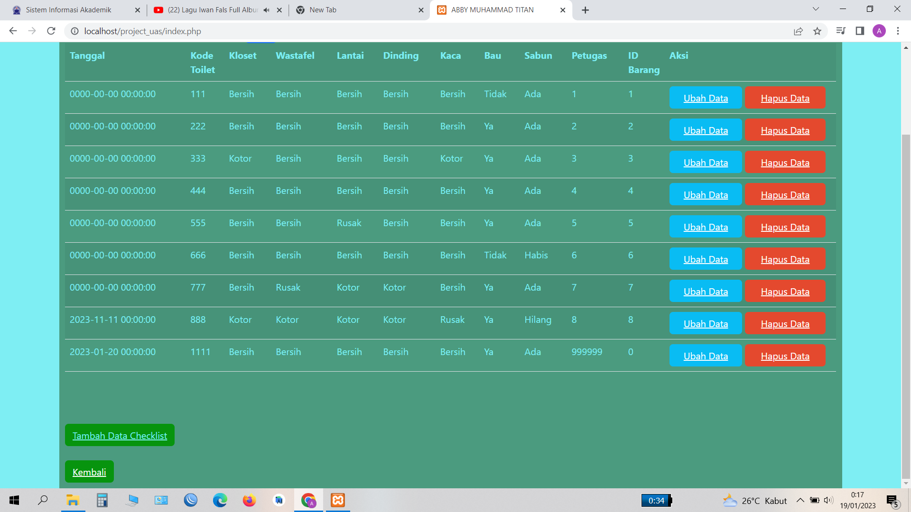

# Project_UAS Membuat data checklist kebersihan Toilet
# Abby Muhammad Titan
# 312110546
# Pemograman web 1
#
#
# Berikut adalah langkah-langkah nya
# Langkah 1
# Membuka xampp, kemudian start apache dan mysql

# Langkah 2
# Mencoba untuk menambahkan data checklist

# Langkah 3
# Dan  ini hasil menambahkan data checklist toilet

# Langkah 4
# Langkah berikut nya mencoba untuk mengubah data checklist kebersihan data toilet

# Langkah 5
# Dan ini hasil mengubah data checklist toilet

# Langkah 6
# Saya mencoba untuk menghapus 2 data checklist kebersihan toilet, dan hasilnya berhasil

#
# Cukup sekian penjelasan dari Project UAS saya
# TERIMA KASIH